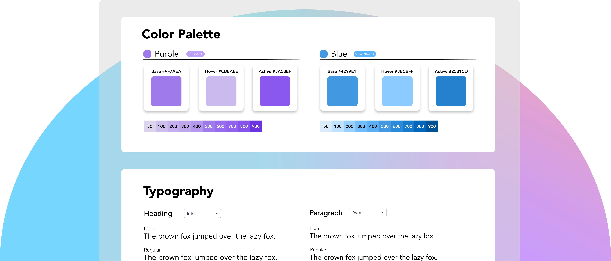
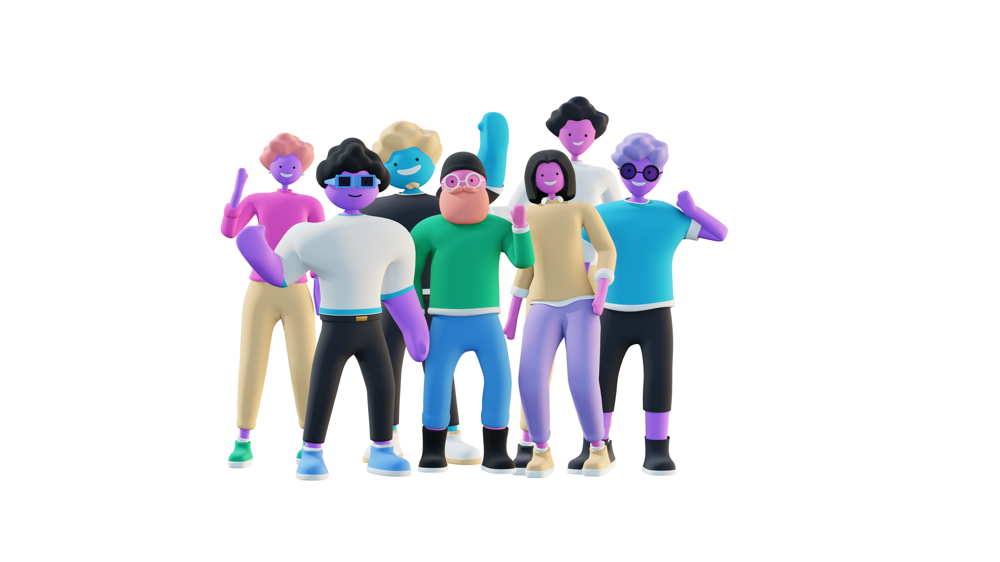

<h1 align="center">
  
  
</h1>
<p align="center">
  <p align="center">The open-source design system framework built for the future.</p>
</p>

<h4 align="center">
  <a href="https://app.mirrorful.com/">Mirrorful Cloud</a> |
  <a href="https://join.slack.com/t/mirrorful/shared_invite/zt-1ps2xtxh0-2NaixFfFzSKZbr5gw_AHfA">Slack</a> |
  <a href="https://mirrorful.com/">Website</a> | <a href="https://www.mirrorful.com/docs/home/intropage">Documentation</a>
</h4>

<h4 align="center">
  <a href="https://github.com/Mirrorful/mirrorful/blob/main/LICENSE.md">
    
  </a>
  <a href="https://github.com/">
    
  </a>
  <a href="https://github.com/Mirrorful/mirrorful/issues">
    
  </a>
  <a href="https://join.slack.com/t/mirrorful/shared_invite/zt-1ps2xtxh0-2NaixFfFzSKZbr5gw_AHfA">
    
  </a>
  <a href="https://twitter.com/mirrorful">
    
  </a>
</h4>



## Introduction

**[Mirrorful](https://mirrorful.com)** is an open-source design system framework that teams use to create and manage the building blocks of their app. Get started for free with **[Mirrorful Cloud](https://app.mirrorful.com)**.

## ✨ Features

- **[Design tokens](https://www.mirrorful.com/docs/home/export-formats/introduction)** — a single source of truth for your tokens.
- **[Theme generation](https://app.mirrorful.com)** — generate dark mode instantly.
- **[Component library agnostic](https://www.mirrorful.com/docs/home/examples)** — whether you’re a third-party or your in-house library, Mirrorful hooks right in.
- **[Eslint rules](/packages/eslint-plugin/)** — detect hard-coded color strings throughout your project and help you convert them to the Mirrorful theme.
- **[Components](https://forms.gle/tidLkuXsScz1Edj28)** — _coming soon_ 👀

## ☁️ Get started

Check out our **[quickstart guide](https://www.mirrorful.com/docs/home/intropage)**.

### Mirrorful Cloud

The fastest way to get started with Mirrorful is with **[Mirrorful Cloud](https://mirrorful.com)**.

### Alternatively, run Mirrorful locally:

To run Mirrorful locally, you need to run both the `web` project and the `server`.

```bash
git clone https://github.com/Mirrorful/mirrorful.git; cd mirrorful; cd apps/web; yarn; yarn dev
```

Visit `localhost:3000`. In a separate window, run the server at `localhost:8080`:

Before running the server, you'll need to install `mongodb` and run it in the background:

```bash
# from project root
cd packages/server; brew tap mongodb/brew; brew install mongodb-community@6.0; mongod --dbpath ./db/data
```

```bash
# from project root
cd packages/server; yarn; yarn dev
```

## ⭐ Open-source vs. paid

This repo is entirely MIT licensed. Need any integrations or want a new feature? Feel free to [create an issue](https://github.com/Mirrorful/mirrorful/issues) or contribute directly to the repository. The first draft of this README was made by a contributor!

To learn more, please visit our [pricing page](https://www.mirrorful.com/pricing).

## 🛠️ Contributing

Whether it's big or small, we love contributions. Check out our **[contributing guide](https://mirrorful.com/docs/home/contributing)**.

### Community & Support

- [Slack](https://join.slack.com/t/mirrorful/shared_invite/zt-1ps2xtxh0-2NaixFfFzSKZbr5gw_AHfA) join our growing community!
- [Issues](https://github.com/Mirrorful/mirrorful/issues) report any bugs you encounter using Mirrorful.
- [YouTube](https://www.youtube.com/channel/UCcwtacSuKB8itMDMIfkkuHQ) watch content about coding and design systems.
- [Docs](https://www.mirrorful.com/) read our documentation.

### Acknowledgements

The avatars of all contributors will be added to this section as a thank you. We are so appreciative of everyone who makes Mirrorful special. Be part of the movement! Join us on **[Slack](https://join.slack.com/t/mirrorful/shared_invite/zt-1ps2xtxh0-2NaixFfFzSKZbr5gw_AHfA)** and try out **[Mirrorful Cloud](app.mirrorful.com)**.

<a href="https://github.com/teddarific"></a> <a href="https://github.com/isabellytubao"></a> <a href="https://github.com/gfang200"></a> <a href="https://github.com/sallyxu"></a> <a href="https://github.com/zachsnoek"></a>
<a href="https://github.com/tobiasdossinger"></a>
<a href="https://github.com/lagneshthakur"></a>
<a href="https://github.com/Pranav2612000"></a>
<a href="https://github.com/joelcmk"></a>
<a href="https://github.com/karanvirsb"></a>
<a href="https://github.com/ktra99"></a>
<a href="https://github.com/Bismay5467"></a>
<a href="https://github.com/dsinghvi"></a>
<a href="https://github.com/sonylomo"></a>
<a href="https://github.com/semijacks"></a>

<div align="center">
  
</div>
