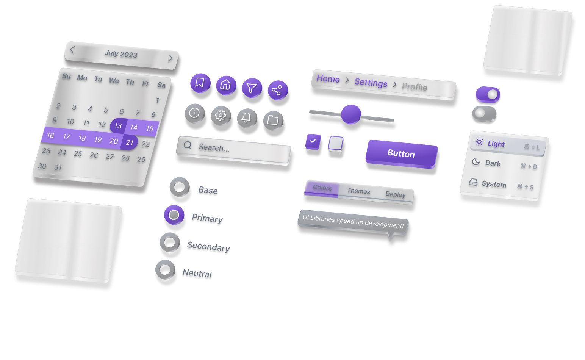

<h1 align="center">
  
</h1>
<p align="center">
  <p align="center">Mirrorful UI is a free, customizable, production-ready React component library built by the team at <a href="https://www.magicpatterns.com/">Magic Patterns</a>.
</p>
</p>

<h4 align="center">
  <a href="https://www.magicpatterns.com/">Magic Patterns</a> |
  <a href="https://join.slack.com/t/magic-patterns/shared_invite/zt-1ps2xtxh0-2NaixFfFzSKZbr5gw_AHfA">Community Slack</a> |
</h4>

<h4 align="center">
  <a href="https://github.com/Mirrorful/mirrorful/blob/main/LICENSE.md">
    
  </a>
  <a href="https://github.com/">
    
  </a>
  <a href="https://join.slack.com/t/mirrorful/shared_invite/zt-1ps2xtxh0-2NaixFfFzSKZbr5gw_AHfA">
    
  </a>
  <a href="https://twitter.com/magicpatterns">
    
  </a>
</h4>



## Features

- **[Easily Customizable](https://app.mirrorful.com)** — production-ready, customizable React components
- **[Eslint Rules](/packages/eslint-plugin/)** — detect hard-coded color strings throughout your project and help you convert them to the Mirrorful theme.

## Installation

The fastest way to get started with Mirrorful is with **[Mirrorful Cloud](https://mirrorful.com)**. Alternatively, you can install the `@mirrorful` package and its peer dependencies.

```sh
npm install @fortawesome/fontawesome-svg-core @fortawesome/free-regular-svg-icons @fortawesome/free-solid-svg-icons @fortawesome/react-fontawesome @radix-ui/react-popover classnames dayzed react-transition-group
```

## Open-source vs. paid

If you are interested in learning more, feel free to [book a meeting with us]([https://cal.com/alexdanilowicz](https://cal.com/adanilowicz/generating-custom-ui-with-patterns):

<a href="https://cal.com/adanilowicz/generating-custom-ui-with-patterns"></a>

## Join our community of designers and engineers!

Join our [Slack community](https://join.slack.com/t/mirrorful/shared_invite/zt-1ps2xtxh0-2NaixFfFzSKZbr5gw_AHfA) of frontend engineers and designers.

- [Slack]([https://join.slack.com/t/mirrorful/shared_invite/zt-1ps2xtxh0-2NaixFfFzSKZbr5gw_AHfA](https://join.slack.com/t/magic-patterns/shared_invite/zt-1ps2xtxh0-2NaixFfFzSKZbr5gw_AHfA) — join our growing community!
- [Issues](https://github.com/Mirrorful/mirrorful/issues) — report any bugs you encounter using Mirrorful UI
- [YouTube](https://www.youtube.com/channel/UCcwtacSuKB8itMDMIfkkuHQ) — watch content about coding and design systems.

<div align="center">
  
</div>

## Testimonials

> “As a CTO, I've seen our UI development 5x, and collaboration with designers is now a seamless, integrated experience. Mirrorful is not just a component library; it's the catalyst that streamlines building out UI.” — George Fang, CTO of Canopy

> "Mirrorful Cloud is an essential part of my design toolkit. It has bridged the gap between my designs and our engineering team. Saved us countless hours." — Zach Zimbler, Founder of Swishjam

> "It translates my designs into workable code with such precision, it's like having an additional team member who speaks both design and engineering fluently. I can't imagine going back to our old way of working.” — Brandon Strittmatter, Founder of Outerbase

## Acknowledgements

Thanks to all our contributors!

<a href="https://github.com/teddarific"></a> <a href="https://github.com/isabellytubao"></a> <a href="https://github.com/gfang200"></a> <a href="https://github.com/sallyxu"></a> <a href="https://github.com/zachsnoek"></a>
<a href="https://github.com/tobiasdossinger"></a>
<a href="https://github.com/lagneshthakur"></a>
<a href="https://github.com/Pranav2612000"></a>
<a href="https://github.com/joelcmk"></a>
<a href="https://github.com/karanvirsb"></a>
<a href="https://github.com/ktra99"></a>
<a href="https://github.com/Bismay5467"></a>
<a href="https://github.com/dsinghvi"></a>
<a href="https://github.com/sonylomo"></a>
<a href="https://github.com/semijacks"></a>
