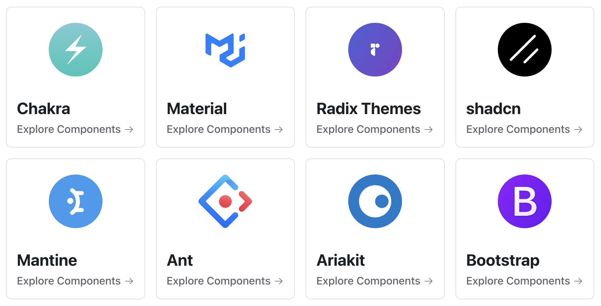
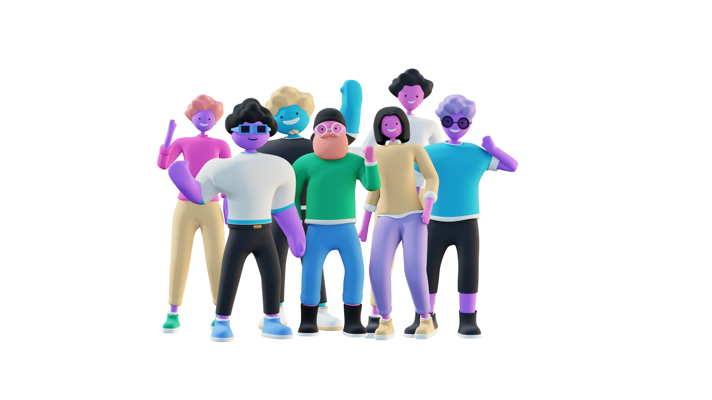

<h1 align="center">
  
</h1>

  
Find the perfect component from a variety of design systems with the <a href="https://www.magicpatterns.com/">Magic Patterns</a> Catalog.

<h4 align="center">
  <a href="https://www.magicpatterns.com/">Magic Patterns</a> |
  <a href="https://join.slack.com/t/magic-patterns/shared_invite/zt-1ps2xtxh0-2NaixFfFzSKZbr5gw_AHfA">Community Slack</a>
</h4>

<h4 align="center">
  
  
  
  
</h4>

## Features

- **Browse by Design System** — Find sets of visually consistent components.
- **Browse by Component Type** — Compare components across to find the perfect one.

## Generating Custom UI with Magic Patterns

If you are interested in learning more about generating custom UI from your design system, feel free to [book a meeting with us](https://cal.com/adanilowicz/generating-custom-ui-with-patterns):

## Join our community of designers and engineers!

Join our [Slack community](https://join.slack.com/t/magic-patterns/shared_invite/zt-1ps2xtxh0-2NaixFfFzSKZbr5gw_AHfA) of frontend engineers and designers.

- [Slack](https://join.slack.com/t/magic-patterns/shared_invite/zt-1ps2xtxh0-2NaixFfFzSKZbr5gw_AHfA) — join our growing community!
- [YouTube](https://www.youtube.com/channel/UCcwtacSuKB8itMDMIfkkuHQ) — watch content about coding and design systems.
- [X](https://twitter.com/magicpatterns) - follow our latest updates on X.

  

