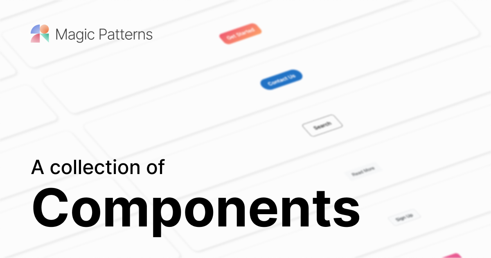

# The Catalog by Magic Patterns

  
Discover the perfect component from a variety of design systems from the <a href="https://www.magicpatterns.com/">Magic Patterns</a> <a href="https://www.magicpatterns.com/catalog">Catalog</a>.

<h4 align="center">
  <a href="https://www.magicpatterns.com/">Magic Patterns</a> |
  <a href="https://join.slack.com/t/magic-patterns/shared_invite/zt-1ps2xtxh0-2NaixFfFzSKZbr5gw_AHfA">Community Slack</a>
</h4>

<h4 align="center">
  
  
  
  
</h4>

<h4 align="center">

</h4>

## Generating UI with Magic Patterns

Magic Patterns helps engineers ship faster by generating frontend code from your React component library.

If you are interested in learning more about generating UI from your design system, feel free to [book a meeting with us](https://cal.com/adanilowicz/generating-custom-ui-with-patterns):

## Join our community of designers and engineers!

- [Slack](https://join.slack.com/t/magic-patterns/shared_invite/zt-1ps2xtxh0-2NaixFfFzSKZbr5gw_AHfA) — join our growing community!
- [YouTube](https://www.youtube.com/channel/UCcwtacSuKB8itMDMIfkkuHQ) — watch content about coding and design systems.
- [X](https://twitter.com/magicpatterns) - follow our latest updates on X.
